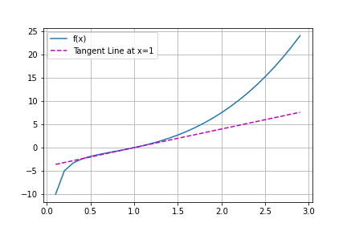
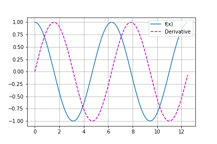
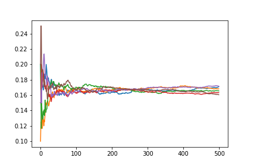
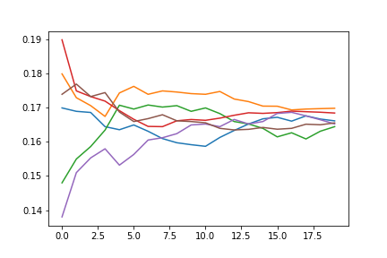

> Name: G Reddy Akhil Teja\
> Email: akhilgodvsdemon@gmail.com\
> Date: 26-08-2020

# D2L Exercises
- [D2L Exercises](#d2l-exercises)
  - [2.1 Data Manipulation](#21-data-manipulation)
  - [2.2 Data PreProcessing](#22-data-preprocessing)
  - [2.3 Linear Algebra](#23-linear-algebra)
  - [2.4 Calculus](#24-calculus)
  - [2.5 Automatic Differentiation](#25-automatic-differentiation)
  - [2.6 Probability](#26-probability)
  - [2.7 Documentation](#27-documentation)

## [2.1 Data Manipulation](https://d2l.ai/chapter_preliminaries/ndarray.html#exercises)

    1. Run the code in this section. Change the conditional statement X == Y in this section to X < Y or X > Y, and then see what kind of tensor you can get.

**Answer**:
```
For X > Y the output is:

<tf.Tensor: shape=(3, 4), dtype=bool, numpy=
array([[False, False, False, False],
       [ True,  True,  True,  True],
       [ True,  True,  True,  True]])>

For X < Y the output is:

<tf.Tensor: shape=(3, 4), dtype=bool, numpy=
array([[ True, False,  True, False],
       [False, False, False, False],
       [False, False, False, False]])>
```

    2. Replace the two tensors that operate by element in the broadcasting mechanism with other shapes, e.g., 3-dimensional tensors. Is the result the same as expected?

**Answer**:
```
X = tf.reshape(tf.range(12),(2,3,2))

Y = tf.ones(3,dtype=tf.int32)

Y = tf.reshape(Y,(3,1))

X+Y

Output is:

<tf.Tensor: shape=(2, 3, 2), dtype=int32, numpy=
array([[[ 1,  2],
        [ 3,  4],
        [ 5,  6]],

       [[ 7,  8],
        [ 9, 10],
        [11, 12]]], dtype=int32)>
```

## [2.2 Data PreProcessing](https://d2l.ai/chapter_preliminaries/pandas.html)

    1. Delete the column with the most missing values.
**Answer**:
```
# Import Packages
import pandas as pd
import numpy as np

# Define Columns
columns = ["age","weight","height","gender"]

# Random Raw Data
data = [
    [21,72,190,"M"],
    [20,65,176,np.nan],
    [19,54,168,"F"],
    [34,75,180,np.nan],
    [21,72,190,"M"],
    [20,65,176,"F"],
    [19,54,168,"F"],
    [34,75,180,np.nan],
    [21,72,190,"M"],
    [20,65,176,np.nan],
    [19,54,168,"F"],
    [34,75,180,np.nan]
]

# Load Data into DataFrame
df = pd.DataFrame(data,columns = columns)

# output of DataFrame

    age	weight	height	gender
0	21	72	    190	    M
1	20	65	    176	    NaN
2	19	54	    168	    F
3	34	75	    180	    NaN
4	21	72	    190	    M
5	20	65	    176	    F
6	19	54	    168	    F
7	34	75	    180	    NaN
8	21	72	    190	    M
9	20	65	    176	    NaN
10	19	54	    168	    F
11	34	75	    180	    NaN

# Get Missing Values
df.isna().sum()

age       0
weight    0
height    0
gender    5
dtype: int64

# Gender is the column having most missing values. Remove Gender Column

df = df.drop("gender",axis=1)

# Get df

    age	weight	height
0	21	72	    190
1	20	65	    176
2	19	54	    168
3	34	75	    180
4	21	72	    190
5	20	65	    176
6	19	54	    168
7	34	75	    180
8	21	72	    190
9	20	65	    176
10	19	54	    168
11	34	75	    180

```

    1. Convert the preprocessed dataset to tensor format.

**Answer**:
```
tf.constant(df.values)

#Output
<tf.Tensor: shape=(12, 3), dtype=int64, numpy=
array([[ 21,  72, 190],
       [ 20,  65, 176],
       [ 19,  54, 168],
       [ 34,  75, 180],
       [ 21,  72, 190],
       [ 20,  65, 176],
       [ 19,  54, 168],
       [ 34,  75, 180],
       [ 21,  72, 190],
       [ 20,  65, 176],
       [ 19,  54, 168],
       [ 34,  75, 180]])>
```
## [2.3 Linear Algebra](https://d2l.ai/chapter_preliminaries/linear-algebra.html)

1. Prove that the transpose of a matrix A’s transpose is A :
   $(A^T)^T=A$\
   \
**Answer**:\
Let $\mathbf{A}\in\mathbb{R}^{m \times n}$ and $x_{ij}$ be an element in $\mathbf{A}$. For $\mathbf{A}^T$ the values get interchanged i.e $x_{ji}$. Now applying transpose for $(\mathbf{A}^T)^T$ interchanges the elements from $x_{ji}$ to $x_{ij}$. Therefore it is proved.

2. Given two matrices  A  and  B , show that the sum of transposes is equal to the transpose of a sum: $\mathbf{A}^T+\mathbf{B}^T=(\mathbf{A}+\mathbf{B})^T$

    **Answer**:\
    Let's consider $a_{ij}$ and $b_{ij}$ belong to elements of matrices $\mathbf{A}$ and $\mathbf{B}$. Therefore for $\mathbf{A}+\mathbf{B}$ the element is $a_{ij}+b_{ij}$ and $(\mathbf{A+B})^T$ the element is $a_{ji}+b_{ji}$. Similarly for $\mathbf{A}^T+\mathbf{B}^T$ the element is $a_{ji}+b_{ji}$. Therefore $\mathbf{A}^T+\mathbf{B}^T=(\mathbf{A}+\mathbf{B})^T$

3. Given any square matrix  A , is  $\mathbf{A+A^T}$  always symmetric? Why?

    **Answer**:\
    Let's consider $a_{ij}$ belong to elements of Matrix $\mathbf{A}$ For $\mathbf{A+A^T}$ element is $a_{ij}+a_{ji}$ @ $ij$ position and $a_{ji}+a_{ij}$ is the element @ $ji$ position. If we observe elements at both these locations are equal. Therefore the matrix is symmetric.

4. We defined the tensor X of shape (2, 3, 4) in this section. What is the output of len(X)?

    **Answer**:\
    It is 2, as it gives size of external dimension.

5. For a tensor X of arbitrary shape, does len(X) always correspond to the length of a certain axis of X? What is that axis?

    **Answer**:\
    Yes it will correspond the length of external dimension or 0th Axis.

6. Run A / A.sum(axis=1) and see what happens. Can you analyze the reason?

    **Answer**:\
    ```
    X = tf.reshape(tf.range(24),(2,3,4))
    
    X_sum = tf.reduce_sum(X,axis=1)
    
    Output is:
    <tf.Tensor: shape=(2, 4),
    dtype=int32, numpy=
    array([[12, 15, 18, 21],
       [48, 51, 54, 57]], dtype=int32)>
    
    X/X_sum gives error as the dimensions aren't compatible for broadcasting.

    X_sum = tf.reduce_sum(X,axis=[0,1])

    Output is :
    <tf.Tensor: shape=(4,), dtype=int32, numpy=array([60, 66, 72, 78], dtype=int32)>

    X/X_sum computes to:
    <tf.Tensor: shape=(2, 3, 4), dtype=float64, numpy=
    array([[[0.        , 0.01515152, 0.02777778, 0.03846154],
        [0.06666667, 0.07575758, 0.08333333, 0.08974359],
        [0.13333333, 0.13636364, 0.13888889, 0.14102564]],

       [[0.2       , 0.1969697 , 0.19444444, 0.19230769],
        [0.26666667, 0.25757576, 0.25      , 0.24358974],
        [0.33333333, 0.31818182, 0.30555556, 0.29487179]]])>
    
    Here X_sum reduces along 0th axis and 1st axis.
    ```

7. When traveling between two points in Manhattan, what is the distance that you need to cover in terms of the coordinates, i.e., in terms of avenues and streets? Can you travel diagonally?

    **Answer**:\
    The distance is $|x_2-x_1|+|y_2-y_1|$
    Yes, we can travel diagonally but in steps.

8. Consider a tensor with shape (2, 3, 4). What are the shapes of the summation outputs along axis 0, 1, and 2?

    **Answer**:\
    axis=0: (3,4)
    axis=1: (2,4)
    axis=2: (2,3)

9. Feed a tensor with 3 or more axes to the linalg.norm function and observe its output. What does this function compute for tensors of arbitrary shape?

    **Answer**:\
    ```
    X = tf.reshape(tf.range(24),(2,3,4))
    X = tf.cast(X,tf.float32)
    tf.norm(X)

    Output is :
    <tf.Tensor: shape=(), dtype=float32, numpy=65.757126>

    This is the L2 norm the signifies magnitude of the Tensor.
    ```


## [2.4 Calculus](https://d2l.ai/chapter_preliminaries/calculus.html)
    1. Plot the function  y=f(x)=x3−1x  and its tangent line when  x=1.

Answer:\
```
import matplotlib.pyplot as plt
import numpy as np

def power_func(x,n):
    return x**n

def func(x):
    return power_func(x,3) - power_func(x,-1)

def derivative_func(x):
    return 4*x - 4

x = np.arange(0.1,3,0.1)

y_func, y_derivefunc = func(x), derivative_func(x)

axes = plt.gca()
axes.cla()
for x,y, fmt in zip([x,x],[y_func,y_derivefunc],('-', 'm--', 'g-.', 'r:')):
    axes.plot(x,y,fmt)
set_axes(None, None, None, None, 'linear', 'linear', ['f(x)','Tangent Line at x=1']) # defined in this chapter
plt.savefig("Tangent-Line Plot",format="png")
```



    2. Find the gradient of the function:

$\mathbf{f(x)=3x^2+5e^{x^2}}$


**Answer**:\
    The gradient of the function is:
    $\mathbf{f'(x)=6x+10x^3e^{x^2}}$


    3. What is the gradient of:

$\mathbf{f(x)=||x||_2}$

**Answer**:\
$\mathbf{f'(x)=|x|/||x||_2}$

    4. Chain Rule for the case where 

$u=f(x,y,z),\; x=x(a,b),\; y=y(a,b),\; z=z(a,b)$

** Answer **:\

$${\frac{\partial f}{\partial a}=\frac{\partial f}{\partial x}\frac{\partial x}{\partial a}}+\frac{\partial f}{\partial y}\frac{\partial y}{\partial a}+\frac{\partial f}{\partial z}\frac{\partial z}{\partial a}$$

$${\frac{\partial f}{\partial b}=\frac{\partial f}{\partial x}\frac{\partial x}{\partial b}}+\frac{\partial f}{\partial y}\frac{\partial y}{\partial b}+\frac{\partial f}{\partial z}\frac{\partial z}{\partial b}$$


## [2.5 Automatic Differentiation](https://d2l.ai/chapter_preliminaries/autograd.html)

    1.Why is the second derivative much more expensive to compute than the first derivative?

**Answer**:\
First Order Derivative of a scalar valued function for a given vector x is given as followed:

Let $\mathbf{x}\in\mathbb{R}^{n}$ and  $f:\mathbb{R^n \rightarrow R }$ then

$$\nabla_{\mathbf{x}}=\bigg[\frac{\partial f}{\partial x_1},
\frac{\partial f}{\partial x_2},
\frac{\partial f}{\partial x_3},
\frac{\partial f}{\partial x_4},
\ldots,
\frac{\partial f}{\partial x_n} \bigg]$$

this is a matrix of order 1xn elements.

Let's have second order derivative which is given by differentiating $\nabla_x$ over $x_1,\ldots,x_n$
$$\nabla^2_{\mathbf{x}}=\begin{bmatrix}
    \frac{\partial^2 f}{\partial x_1^2}&
\frac{\partial^2 f}{\partial x_1x_2}&
\cdots&
\frac{\partial f}{\partial x_1x_n}\\
\frac{\partial^2 f}{\partial x_2x_1}&
\frac{\partial^2 f}{\partial x_2^2}&
\cdots&
\frac{\partial f}{\partial x_2x_n}\\
\vdots&\vdots&\ddots&\vdots\\
\frac{\partial^2 f}{\partial x_nx_1}&
\frac{\partial^2 f}{\partial x_nx_2}&
\cdots&
\frac{\partial f}{\partial x_n^2}\\
\end{bmatrix}$$

this is a matrix of order nxn, also each element is differentiated twice, therefore the order of computation is $n^4$ compared to first-order computation.

Therefore the computation is large

    2. After running the function for backpropagation, immediately run it again and see what happens.

**Answer**:
None (Pls give PR if you know it)

    3. In the control flow example where we calculate the derivative of d with respect to a, what would happen if we changed the variable a to a random vector or matrix. At this point, the result of the calculation f(a) is no longer a scalar. What happens to the result? How do we analyze this?

**Answer**:\
The gradient of vector output function is a vector. The result is similar to that of scalar except that the result now is a vector having same gradient across the dimension.

    4. Redesign an example of finding the gradient of the control flow. Run and analyze the result.

**Answer**:\
```
def f(a):
    b = a * 2
    while tf.norm(b) < 1000:
        b = b ** 2
    if tf.reduce_sum(b) > 0:
        c = b*2
    else:
        c = 100 * b
    return c
```
Here gradient is proportional to value of 'a'. Therefore the gradients calculate for a vector should be proportional to their magnitudes.

$$a=\begin{bmatrix}
     0.51526976\\
     -0.10544211\\
     2.3910053 
\end{bmatrix}$$

We obtain gradients that are proportional to the magnitudes with respect to their dimension.
$$a=\begin{bmatrix}
     -8.5661167e-01\\
     -1.0620662e+02\\
     2.2162100e+05
\end{bmatrix}$$

   5. Let  f(x)=sin(x) . Plot  f(x)  and  df(x)/dx , where the latter is computed without exploiting that  f′(x)=cos(x).

**Answer**:\
```
def sin_func(x):
    return tf.math.sin(x)

a = tf.Variable(tf.range(0,np.deg2rad(360*2),0.1))

with tf.GradientTape() as t:
    y_func = sin_func(a)

y_grad = t.gradient(y_func,a)

axes = plt.gca()
axes.cla()
for x,y, fmt in zip([a,a],[y_grad,y_func],('-', 'm--', 'g-.', 'r:')):
    axes.plot(x,y,fmt)
set_axes(None, None, None, None, 'linear', 'linear', ['f(x)','Derivative']) # Get the function from (https://d2l.ai/chapter_preliminaries/calculus.html)

plt.savefig("Tangent-Line Plot",format="png")
```



## [2.6 Probability](https://d2l.ai/chapter_preliminaries/probability.html#exercises)
    1.We conducted  m=500  groups of experiments where each group draws  n=10  samples. Vary  m  and  n . Observe and analyze the experimental results.

**Answer**:\
Here we have two different experiments one with m=500 and n=20 and other with m=20 and n=500. Below are the graphs

m=500 and n=20


m=20 and n=500


We can observe that second experiment is getting converged from first group itself.

    2.Given two events with probability  P(A)  and  P(B), compute upper and lower bounds on  P(A∪B)  and  P(A∩B) . (Hint: display the situation using a Venn Diagram.)

**Answer**:\
Hopefully thinking that they are simple venn diagrams. Therefore please refer to the link: 

    3. Assume that we have a sequence of random variables, say  A ,  B , and  C , where  B  only depends on  A , and  C  only depends on  B , can you simplify the joint probability  P(A,B,C) ? (Hint: this is a Markov Chain.)

**Answer**:\
$$P(A, B, C) = P(C | A, B) * P(A, B) = P(C | A, B) * [P(B | A) * P(A)] $$
Credits: [goldpiggy](https://discuss.d2l.ai/u/goldpiggy)

## [2.7 Documentation](https://d2l.ai/chapter_preliminaries/lookup-api.html)
    1. Look up the documentation for any function or class in the deep learning framework. Can you also find the documentation on the official website of the framework?

**Answer**:\
help(tf.tensordot)

documentation
```
Help on function tensordot in module tensorflow.python.ops.math_ops:

tensordot(a, b, axes, name=None)
    Tensor contraction of a and b along specified axes and outer product.
    
    Tensordot (also known as tensor contraction) sums the product of elements
    from `a` and `b` over the indices specified by `a_axes` and `b_axes`.
    The lists `a_axes` and `b_axes` specify those pairs of axes along which to
    contract the tensors. The axis `a_axes[i]` of `a` must have the same dimension
    as axis `b_axes[i]` of `b` for all `i` in `range(0, len(a_axes))`. The lists
    `a_axes` and `b_axes` must have identical length and consist of unique
    integers that specify valid axes for each of the tensors. Additionally
    outer product is supported by passing `axes=0`.
    
    This operation corresponds to `numpy.tensordot(a, b, axes)`.
    
    Example 1: When `a` and `b` are matrices (order 2), the case `axes = 1`
    is equivalent to matrix multiplication.
    
    Example 2: When `a` and `b` are matrices (order 2), the case
    `axes = [[1], [0]]` is equivalent to matrix multiplication.
    
    Example 3: When `a` and `b` are matrices (order 2), the case `axes=0` gives
    the outer product, a tensor of order 4.
    
    Example 4: Suppose that \\(a_{ijk}\\) and \\(b_{lmn}\\) represent two
    tensors of order 3. Then, `contract(a, b, [[0], [2]])` is the order 4 tensor
    \\(c_{jklm}\\) whose entry
    corresponding to the indices \\((j,k,l,m)\\) is given by:
    
    \\( c_{jklm} = \sum_i a_{ijk} b_{lmi} \\).
    
    In general, `order(c) = order(a) + order(b) - 2*len(axes[0])`.
    
    Args:
      a: `Tensor` of type `float32` or `float64`.
      b: `Tensor` with the same type as `a`.
      axes: Either a scalar `N`, or a list or an `int32` `Tensor` of shape [2, k].
        If axes is a scalar, sum over the last N axes of a and the first N axes of
        b in order. If axes is a list or `Tensor` the first and second row contain
        the set of unique integers specifying axes along which the contraction is
        computed, for `a` and `b`, respectively. The number of axes for `a` and
        `b` must be equal. If `axes=0`, computes the outer product between `a` and
        `b`.
      name: A name for the operation (optional).
    
    Returns:
      A `Tensor` with the same type as `a`.
    
    Raises:
      ValueError: If the shapes of `a`, `b`, and `axes` are incompatible.
      IndexError: If the values in axes exceed the rank of the corresponding
        tensor.
```

Docs link: [tensordot](https://www.tensorflow.org/api_docs/python/tf/tensordot)